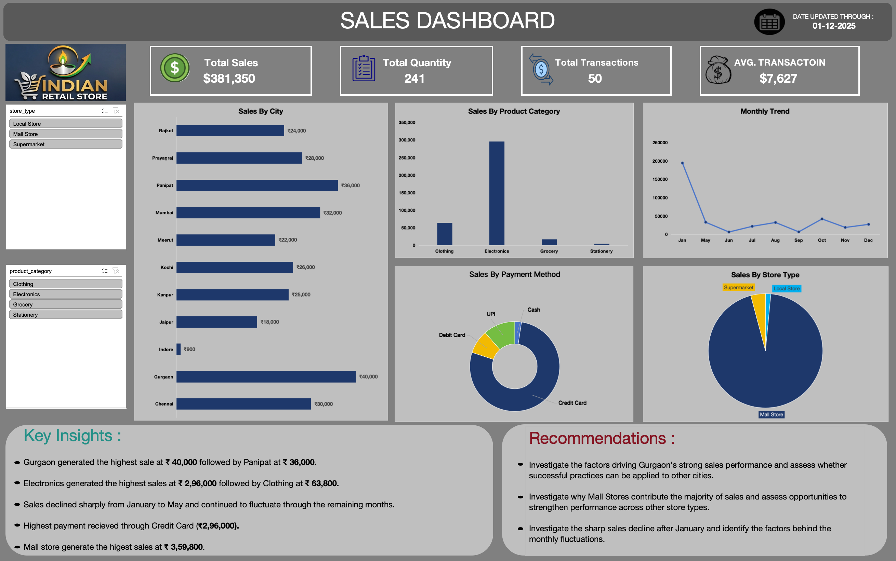
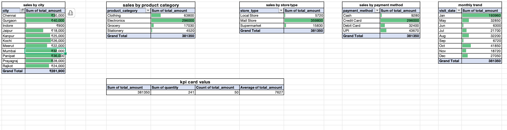
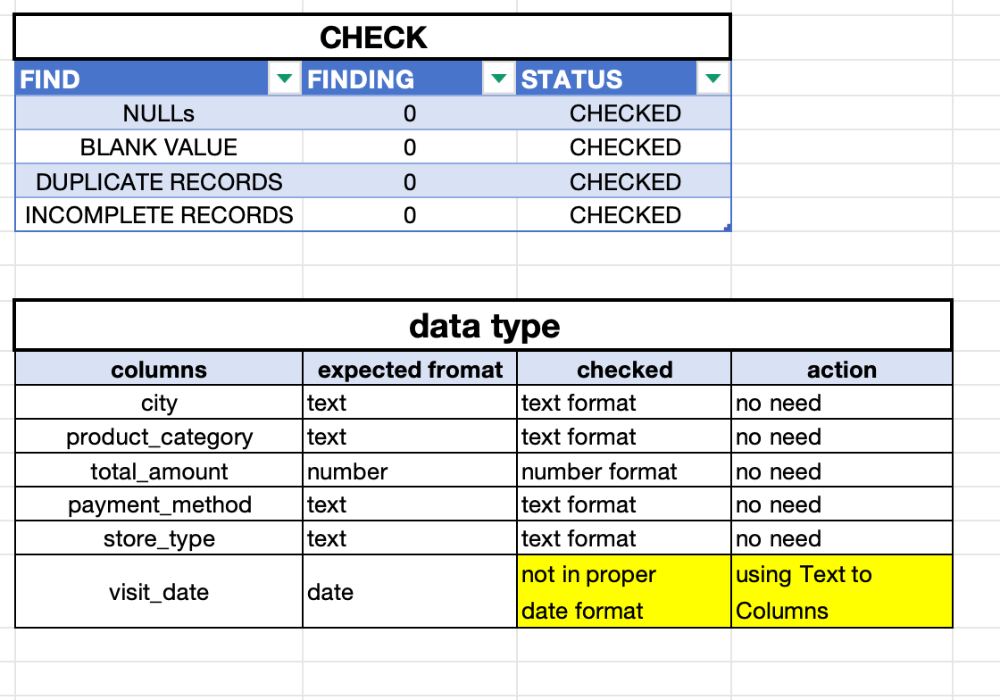

# Indian Retail Sales Excel Take-Home Case Study

## Project Overview

This project is a timed Excel take-home case study based on a retail sales dataset.

The objective was to inspect the data, identify data-quality issues, analyze sales performance, build a dashboard, and provide business insights and recommendations within a limited time.

## Time Constraint

Target time: 3 hours

Actual completion time: approximately 3.5 hours

## Tool Used

- WPS Office Spreadsheet

## Data Quality Checks

The dataset was checked for:

- NULL values
- Blank values
- Duplicate records
- Incomplete records
- Incorrect data types

A date-format issue was identified in the `visit_date` column and corrected before analysis.

## Analysis Performed

PivotTables were created to analyze:

1. Sales by City
2. Sales by Product Category
3. Sales by Store Type
4. Sales by Payment Method
5. Monthly Sales Trend

## Dashboard KPIs

- Total Sales: ₹381,350
- Total Quantity: 241
- Total Transactions: 50
- Average Transaction Value: ₹7,627

## Dashboard Visualizations

- Sales by City
- Sales by Product Category
- Monthly Trend
- Sales by Payment Method
- Sales by Store Type

## Key Business Insights

- Gurgaon generated the highest city-level sales at ₹40,000, followed by Panipat at ₹36,000.
- Electronics generated the highest sales at ₹2,96,000.
- Mall Stores generated the highest sales among the store types at ₹3,59,800.
- The highest payment recieved from Credit Card among payment methods at ₹2,96,000.
- Sales showed noticeable fluctuations across months.

## Business Recommendations

- Investigate the factors driving strong sales performance in Gurgaon and assess whether successful practices can be applied to other cities.
- Investigate the strong performance of Electronics and identify opportunities to grow the category further.
- Analyze why Mall Stores contribute the majority of sales and identify ways to improve other store types.
- Investigate the reasons behind monthly sales fluctuations.

## Self-Critique

The target completion time was 3 hours, while the actual completion time was approximately 3.5 hours.

The most time-consuming areas were:

- Converting the `visit_date` column into the correct date format
- Managing slicer options
- Data-quality checking

### Improvement Plan

For future take-home tests, I will:

- Perform data-quality checks more systematically
- Reduce time spent on dashboard formatting
- Prioritize analysis and insights over cosmetic improvements
- Communicate findings using shorter and clearer language

## Dashboard Preview

## PivotTable Analysis

## Data Quality Check

## Row Dataset

## Project File

The complete workbook is available in:

## Learning Outcome

This case study helped me practice Excel-based data cleaning, PivotTable analysis, KPI creation, dashboard design, business insight generation, and time management under a deadline.
